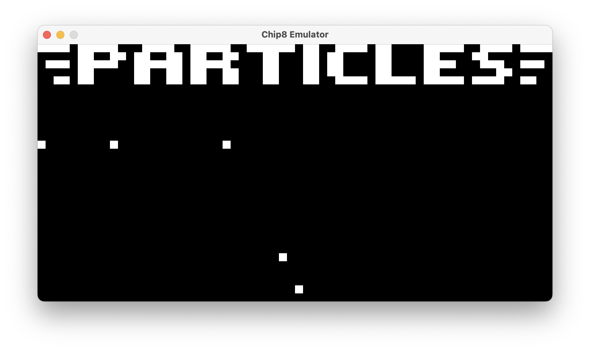
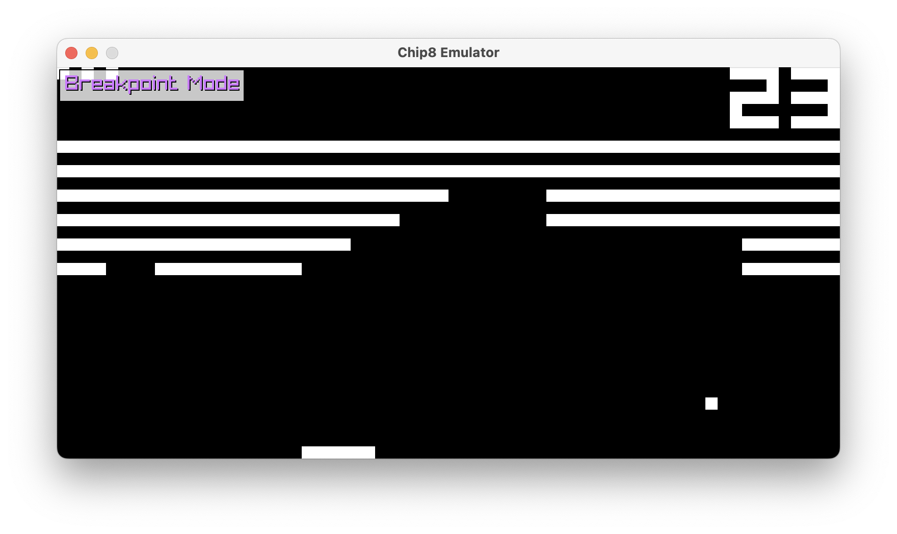
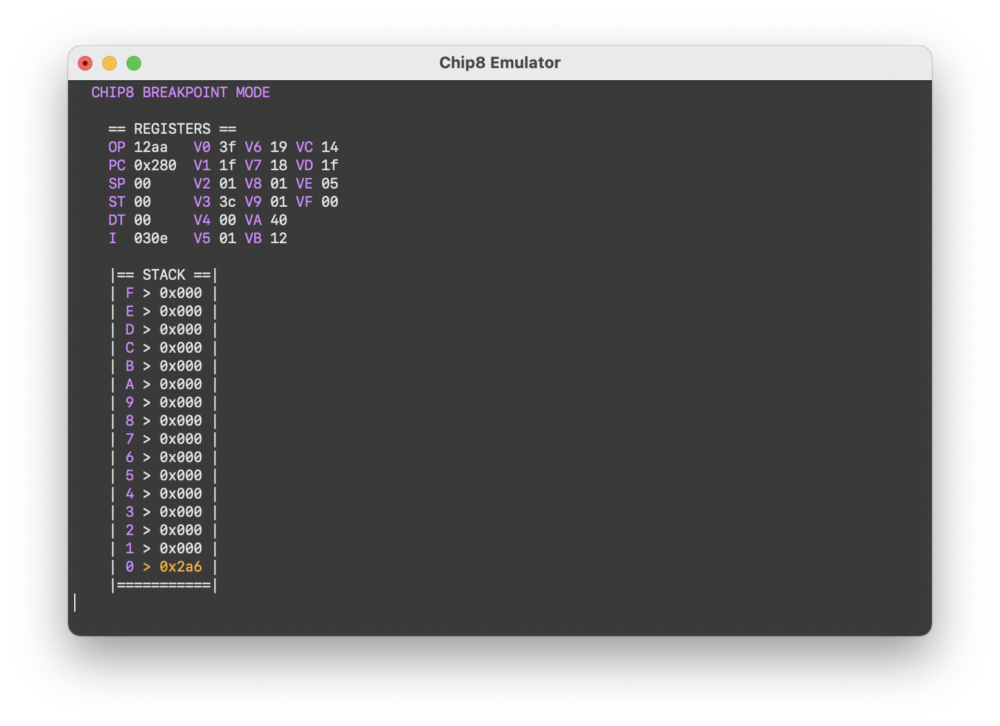

<h1></h1>
<div align="center">
    <h3>Chip8 Emulator Written in C</h3>
</div>

<h3>Using the emulator is very simple:</h3>

```sh
./chip8 <scale> <rom path>
```

<h3>Building it is no more difficult...</h3>

```sh
git clone github.com/PolymorphicHeart/chip8
cd chip8
./cmake -S . -B ./bin -G "Unix Makefiles"
```

<h3>Running a ROM normally...</h3>

<table>
<tr><th>Original Mapping</th><th>Emulator Mapping</th></tr>
<tr><td>

| 1 | 2 | 3 | C |
|---|---|---|---|
| 4 | 5 | 6 | D |
| 7 | 8 | 9 | E |
| A | 0 | B | F |

</td><td>

| 1 | 2 | 3 | 4 |
|---|---|---|---|
| Q | W | E | R |
| A | S | D | F |
| Z | X | C | V |

</td></tr> </table>



<h3>Stepping through the emulator:</h3>

* press 'p' to toggle breakpoint mode
* press or hold 'enter' / 'return' to single-step in bp mode



Terminal view while in breakpoint mode:

